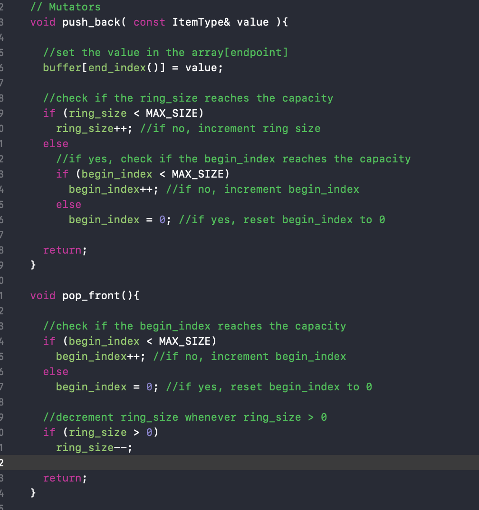
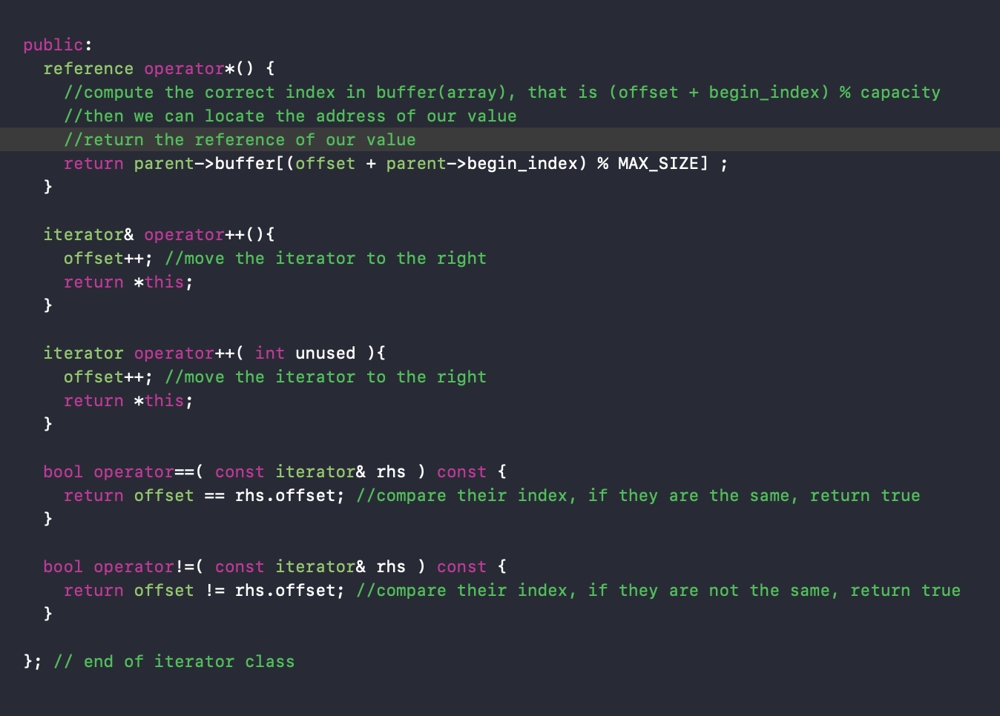
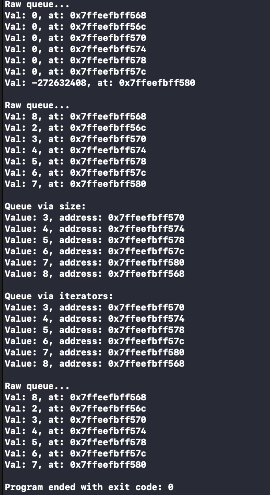

# My Other Repository
Please go check them out
\
Final Project: https://github.com/ukmerry/PI0C-Final-Project.git
\
Assigment 2: https://github.com/ukmerry/PIC10C-GradeCalculator.git
\
Assigment 1: https://github.com/ukmerry/PIC-10C-Assignment1.git

# PIC10C-Assignment-3
The objective of the assignment 3 is to create a ring_queue with self-customized iterator

Ring queue behave like a regular queue except it has fixed capacity. Whenever the queue reaches its maximum, the next item pushed will take over the first item in the queue.

In this assignment, we are using the regular array as our container. The push_back and pop_front function need to be adjusted in order to fit our ring queue definition.

The project is created by Xcode so it has couples of unrelated files.
Please go to [here](ring_queue/ring_queue/ring_queue.cpp) to check the document

# Functions: push_back and pop_front

# Iterator

# Result

